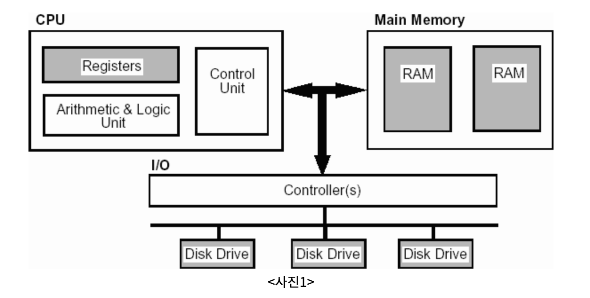

# Go lang 스터디 - 1주차

# 중요 포인트

## 1. 컴퓨터 동작 원리 -p66

```c
1. 프로그램 로드
2. 데이터 로드 및 캐싱
3. 연산 및 저장
4. 프로그램 종료 때 까지 2~3번 반복
```



## 2. 용어정리 - p76

| 용어 | 설명 |
| --- | --- |
| 정적 컴파일 언어 | 미리 기계어로 변환 해두었다가 사용하는 방식의 언어,기계어로 변환해둔 파일을 실행파일 |
| 동적 컴파일 언어 | 실행 시점에 기계어로 변환되는 방식의 언어를 동적 컴파일 언어
정적 컴파일 언어의 단점인 칩셋과 운영체제가 다를 경우 변환되는 형태가 다르다는 점을 고치기 위해 |
| 약 타입 언어 | 타입검사를 약하게 하는 언어 → 동적 타입언어 (Python, javascript) |
| 강 타입 언어 | 타입검사를 강하게 하는 언어 →정적 타입언어 (c, GO, Java) |
| 가비지 콜렉터 | 가비지 콜렉터(Garbage Collector)는 프로그램에서 사용하지 않는 동적으로 할당된 메모리를 자동으로 해제하는 기능을 수행하는 컴퓨터 프로그램 또는 컴포넌트, 메모리 관리의 일환으로, 가비지 콜렉터는 프로그램이 실행 중에 동적으로 할당한 메모리 블록 중에서 더 이상 사용되지 않는 객체 또는 데이터를 식별하고 해제 |
- **가비지 콜렉터**
    
    **JAVA**: 대부분의 경우 힙(Heap) 메모리에서 가비지를 수집, 대표적인 알고리즘으로 “Mark and Sweep” 과 “Copy” 알고리즘을사용
    
    **GO**: 가볍고 일반적으로 매우 짧은 중단 시간을 동작, 개발자가 가비지 콜렉터 동작을 튜닝할 수 있는 몇가지 옵션을 제공, “Stop-the-world” 알고리즘 사용
    
    **Python**: 참조 카운팅(Reference Counting)과 순환 참조탐색(Cycle Detection)을 조합하여 사용하지 않은 객체를 식별하고 해제, 개발자가 가비지 콜렉터 동작을 튜닝할 수 있는 몇가지 옵션을 제공, “Stop-the-world” 알고리즘 사용
    
    <aside>
    💡 Stop-the-world 알고리즘이란?
    "Stop-the-world" 알고리즘은 가비지 콜렉터(Garbage Collector)가 실행되는 동안 애플리케이션의 모든 스레드를 일시적으로 멈추는 방식을 말합니다. 이 알고리즘은 메모리 관리를 위해 사용되며, 가비지 콜렉션 과정에서 동적으로 할당된 객체들 중에서 더 이상 참조되지 않는 가비지 객체들을 식별하고 해제하는 역할을 수행합니다.
    
    1. 일시적으로 모든 애플리케이션 스레드를 정지시킵니다. 이는 가비지 콜렉션을 위해 애플리케이션의 실행을 일시 중단하는 단계입니다.
    2. 정지된 상태에서 가비지 콜렉터가 동작하여 메모리 상에서 가비지 객체를 식별합니다. 이 단계에서는 객체의 참조 상태를 확인하고, 더 이상 사용되지 않는 객체들을 탐지합니다.
    3. 가비지 객체들이 식별되면 해당 객체들의 메모리를 해제합니다. 이는 더 이상 필요하지 않은 객체들을 운영 체제에 반환하는 단계입니다.
    4. 가비지 콜렉션 작업이 완료되면 애플리케이션 스레드를 다시 실행시킵니다. 애플리케이션의 실행은 정지된 상태에서 재개되며, 가비지 콜렉션 이후에
    </aside>
    
    <aside>
    💡 Mark and Sweep 알고리즘 이란?
    
    Mark and Sweep 알고리즘은 다음과 같은 단계로 동작합니다:
    
    1. 가비지 콜렉터는 모든 객체에 대해 가비지 여부를 판단하기 위해 표시(mark) 비트를 설정합니다. 이 단계에서는 모든 객체를 스캔하면서 참조되는 객체들을 마킹합니다.
    2. 가비지 콜렉터는 루트(root) 세트로부터 시작하여 도달 가능한(reachable) 객체들을 탐색합니다. 도달 가능한 객체는 루트 세트부터 시작하여 참조 체인을 따라가면서 도달할 수 있는 객체들을 의미합니다.
    3. 도달 가능한 객체를 마킹한 후, 마킹되지 않은 객체들은 가비지로 판단하여 메모리 해제를 대기하는 상태가 됩니다.
    4. 마킹이 완료된 후에는 스위핑(sweeping) 단계가 시작됩니다. 이 단계에서는 메모리를 해제할 대상이 되는 가비지 객체들을 식별하고, 해당 객체들의 메모리를 해제합니다.
    5. 스위핑이 완료된 후에는 가비지 콜렉션을 마치고, 해제된 메모리를 다시 사용할 수 있게 됩니다.
    </aside>
    
    가비지 콜렉터 논문 - The next 700 programming languges
    
    [](https://dl.acm.org/doi/pdf/10.1145/365230.365257)
    

## 3. 가볍게 GO 입문하기 - p.86

- 코드가 실행되기 까지
    
    ```c
    1. 폴더 생성
    2. '.go' 파일 생성 및 작성
    3. GO 모듈 생성
    4. 빌드
    5. 실행
    ```
    
    -**폴더 생성**: Go 언어에서 모든 코드는 패키지 단위로 작성(같은 폴더에 위치한 파일은 모두 같은 패키지)
    
    goproject/hello(hello 폴더에 든 .go 파일은 hello 패키지) /extra(extra 폴더에 든 .go 파일은 extra 패키지) 
    
    -**모듈 생성**: 기본적으로 Go 모듈이 적용됨에 따라 빌드하기 전에 모듈을 생성 ‘go mod init {Directory path}’ 
    
    -**빌드**: ‘go build’ 명령어를 통해 기계어로 변환하여 실행파일 생성 ‘GOOS’,’GOARCH’ 환경 변수를 조정해서 다른 운영채제와 아키텍처에서 실행되는 실행 파일 생성가능
    
    [ex] AMD64 계열 칩셋 리눅스 실행 파일
    
    ```c
    GOOS=linux GOARCH=amd64 go build
    ```
    
    - 환경 변수 지원 내용
        
        [How To Build Go Executables for Multiple Platforms on Ubuntu 16.04  | DigitalOcean](https://www.digitalocean.com/community/tutorials/how-to-build-go-executables-for-multiple-platforms-on-ubuntu-16-04)
        

## 4. 변수  - p.95

- **변수 선언**
    
    ```go
    var a int = 10
    var income int = a * 10
    
    var c =4 // 타입 생략. 초기화된 값을 기준으로 타입 지정
    c := 5 //선언 대입문 := 사용해서 var 키워드와 타입 생략
    ```
    
- **변수의 4가지 속성**
    
    
    | 이름 | 프로그래머는 이름을 통해 값이 저장된 메모리 공간에 접근 |
    | --- | --- |
    | 값 | 변수가 가리키는 메모리 공간에 저장된 값 |
    | 주소 | 변수가 저장된 메모리 공간의 시작 주소 |
    | 타입 | 변수 값의 형태 |
- **변수 이름 작성시 권장 사항**
    
    1) 영문을 제외한 다른 언어의 문자를 사용하지 않음
    
    2) 변수명에 여러단어가 이어지면 두 번째 단어부터 대문자로 시작 [ex] firstName
    
    3) 변수명은 되도록 짧게 작성
    
    4) _은 일반적으로 사용하지 않음
    
- **변수 타입 종류**

[예제로 배우는 Go 프로그래밍 - Go 데이타 타입](http://golang.site/go/article/5-Go-%EB%8D%B0%EC%9D%B4%ED%83%80-%ED%83%80%EC%9E%85)

## 5. fmt 패키지 - p. 115

- 패키지 내부 함수
    
    
    | 함수명 | 행동 |
    | --- | --- |
    | Print() | 함수 입력 값들을 출력 |
    | Println() | 함수 입력 값들을 출력하고 개행 |
    | Printf() | 서식에 맞도록 입력값들을 출력 |
    
    ```go
    package main
    import "fmt"
    
    func main() {
    	var a int = 10
    	var b int = 20
    	var f float64 = 32799438743.8297
    
    	fmt.Print("a:",a, "b:",b)
    	fmt.Println("a:",a, "b:",b)
    	fmt.Printf("a: %d b: %d f: %f\n",a, ,b)
    }
    
    ```
    
    문자 포맷팅 정보
    
    [Go by Example: 문자열 포맷팅](https://mingrammer.com/gobyexample/string-formatting/)
    

- 최소 출력 너비 지정
    
    최소 출력 너비 지정: 서식 문자의 %와 타입을 나타내는 문자사이에 숫자를 넣어 너비 지정 가능 [ex] %5d
    
    공란 채우기: 너비 앞에 0을 붙이면 빈자리를 0으로 채움 [ex]%05d
    
    왼쪽 정렬하기 : 마이너스를 붙이면 왼쪽 기준선을 삼아 출력
    

## 6. Scan() 함수 - p.123

- 키보드 입력과 함수의 동작 원리
    
    표준 입력 장치로 입력하면 입력 데이터는 내부의 입력 스트림이라는 메모리 공간에 임시저장됨 → scan() 함수들은 표준 입력 스트림에서 값을 읽어서 입력 값 처리
    
    먼저 입력된 데이터가 먼저 읽히는 FIFO 구조
    
    <aside>
    💡 시스템 콜을 통한 호출인가?
    대답은 알 수 없다 입니다 내부적으로 구현되어진 형태가 시스템 콜을 호출하는 구조일 수 있지만 개발 내용에대한 부분을 공유되어있지 않아 정확하지 않다고 합니다
    
    </aside>
    
- command를 지원하기위한 go 자체 패키지
    
    [go command - cmd/go - Go Packages](https://pkg.go.dev/cmd/go)
    

## 7. 실수 오차

컴퓨터에서 실숫값을 표현할 때 지수부와 소수부로 나눠 표현, 모두 2진수로 표현되어있기에 실수를 정확히 표현하기 어려운 문제가 존재

### 해결방안

- 작은 오차 무시
    
    ```go
    package maing
    import "fmt"
    
    const epsilon = 0.00001
    
    func equal(a,b float64) bool {
    	if a > b {
    			if a -b <= epsilon {
    				return true
    		} else {
    			return false
    		}
    	} else {
    		if b -a <- epsilog {
    			return true
    		} else {
    			return false
    		}
    	}
    	
    }
    
    func main() {
    	var a float64 = 0.1
    	var b float64 = 0.2
    	var c float64 = 0.3
    
    	fmt.Printf("%0.18f" + "%0.18f" = "0.18f\n",a,b,a+b )
    	fmt.printf("%0.18f == %0.18f : %v\n",c,a+b,equal(a+b,c))
    
    	a = 0.0000000000004
    	b = 0.0000000000002
    	c = 0.0000000000007
    
    	fmt.Printf("%g == %g : %v\n",c,a+b,equal(a+b,c))
    }
    ```
    

- 오차를 없애는 나은 방법
    
    match 패키지에서 Nextrafter() 함수를 통해 1비트 차이만큼 비교
    
    *제작하는 프로그램이 금융프로그램과 같은 숫자에 민감한 프로그램이라면 math/big 패키지에서 제공하는 Float 객체 사용
    

## 8. 함수

- 정의 방법
    
    함수 키워드, 함수명, 매개 변수, 반환 타입, 함수코드 블록으로 구성
    
    1) Add() 함수 호출
    
    2) 매개변수를 선언하고 입력한 인수값을 복사
    
    3) return 값을 통해 결과 반호나
    
    ```go
    func Add(a int, b int)(int,err ){
    	return a+b, err
    }
    ```