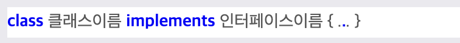

# Go lnag 스터디 -3주차

x

## 랜덤한 숫자를 얻기위한 방법

math/rand **함수만 사용하게되면 랜덤값이 아닌 유사 랜덤 값을 출력(알고리즘에 의해서 마치 랜덤처러 보이는 값)** 랜덤 값을 산출되는 초기 값이 같기때문에 랜덤 시드를 다른 값으로 설정

```go
package main

import (
	"fmt"
	"math/rand"
	"time"
)

func main() {
	rand.Seed(time.Now().UnixNano())

	n:= rand.Intn(100)

	fmt.Println(n)
}
```

## Slice

- 특징
    
    1) 배열와 다르게 최대 저장 값을 지정하지 않고 초기화할 수 있음\
    
    2) 슬라이스 구현은 배열을 가리키는 포인터와 요소 개수를 나타내는 len, 전체 배열 길이를 나타내는 cap으로 이루어짐
    
    3) 배열과 다르게 값 복사가 이루어지는 것이 아닌 실제 메모리 포인터와,len,cap 3개의 값이 복사됨으로 실제 값이 변경됨
    

### 추가와 삭제 방법 -p.357

```go
package cucuridas

import "fmt"

func main() {
	var slice = []int{1,2,3}

	slice2 := append(slice, 4)

	fmt.Println(slice)
	fmt.Println(slice2)
}
```

## append 시 문제 - p363

1) 가정 3개의 항목이 초기화된 slice1의 값을 append 함과 동시에 slice2를 초기화게 되었을때 slice 1의 len 값은 3임으로 slice2의 모든 값을 추가하였더라도 slice1의 값은 채워지지 않다고 판단하여 slice1[4]부터 값을 재정의하게 됨 → 같은 메모리 주소를 바라보고 있음에 따라 slice2[4]의 값도 변경됨

2) 여유 공간이 없을 때는 값이 복사 됨에 따라 서로 다른 메모리주소를 참조하게됩니다 이에따라 값 변경이 공유 되지 않습니다

### 정렬 - sort.Ints() 함수 사용 -p.382

```go
package main

import (
	"fmt"
	"sort"
)

func main() {
	s:= []int{5,2,6,3,1,4}
	sort.Ints(s)
	fmt.Println(s)
}
```

## Method (클래스 변수와 같은 역할)

### 특징 - p.394

- 메소드는 리시버에 속하는 함수
- 응집도를 높이는 중요한 역할을 함→ 산탄총 수술 문제 해결
- 절차 지향 중심이 아닌 객체 지향 중심

### 선언 방법 - p.390

```go
func (r Rabbit) info() int {
	return r.width * r.height
}
```

## Interface

구체화된 객체가 아닌 추사와된 객체로 상호작용

### 선언 방법 - p.409

```go
type DucInterface interface {
	Fly()
	Walk(distance int) int
}
```

1) 인터페이스 정의

2) 인터페이스의 추상화된 메소드를 실제 struct와 method를 활용하여 구현

3) 인스턴스 생성 후 인터페이스 타입으로 초기화

4) 인터페이스의 함수 호출

```go
package cucuridas

import "fmt"

type CarProduct interface {
	getName() string
}

type Genesis struct {
	Name string
}

func (g *Genesis) getName() string {
	return g.Name
}

func (g *Genesis) setName(name string) {
	g.Name = name
}

func main() {
	genesis := &Genesis{ Name: "Mycar"}

	var product CarProduct

	product = genesis

	fmt.Printf("%s\n",product.getName())
	
}
```

### 추상화 계층- p.416

1) 내부 동작을 감춰서 서비스를 제공하는 쪽과 사용한 쪽 모두에게 자유를 주는 방식을 의미

2) 추상화 계층을 이용해 의존 관계를 끊는 것을 디커플링

### 덕타이핑- p.417

덕 타이핑 방식이란 타입 선언 시 인터페이스 구현 여부를 명시적으로 나타낼 필요 없이 인터페이스에 정의한 메서드 포함 여부만으로 결정하는 방식

- JAVA 인터페이스 상속시



- GO 인터페이스 상속은 함수만 구현


### 인터페이스 종류 - p.421

- 다른 인터페이스 포함하는 인터페이스: 다른 인터페이스 메소드 값을 포함하는 인터페이스 생성 가능
- 빈 인터페이스: 어떤 값이든 받을 수 있는 함수, 메서드, 변숫값을 만들 때 사용
- 인터페이스 기본 값 nil : 무조건 타입으로 서 값을 초기화 후 사용하도록 runtime 시 에러 발생

## 함수 고급 편

### 가변 인수 함수 - p.440

- 함수 정의 방법

```go
func sum(nums ...int) int {
	sum := 0

	fmt.Printf("nums 타입: %T\n",nums)
	for _,v:= range nums {
		sum +=v
	}

	return sum
}
```

### defer 지연 실행- p.443

함수가 종료되기 직전에 실행해야하는 코드를 정의 

```go
func main() {
	f, err := os.Create("test.txt")
	if err != nil {
		fmt.Println("Failed to create a file")
		return
	}

	defer f.close()
}
```

### 함수 타입 변수 -p.445

함수의 이름을 변수로 받아 실행 시키는 구조

```go
package cucuridas

import "fmt"

func add(a,b int) int {
	return a+b
}

func mul(a,b int) int {
	return a*b
}

func geOperator(op string) func (int, int) int {
	if op == "+" {
		return add
	}else if op == "*" {
		return mul
	} else {
		return nil
	}
}

func main() {

	var oprator func (int int) int
	oprator = geOperator("*")

	var result = oprator(3,4)
	fmt.Println(result)
}
```

### 함수 리터럴

함수의 정의 없이 정의하여 사용 lambda라고도 함, *함수 리터럴 외부 변수를 내부 상태로 가져오는 것을 캡처라고 칭하며 값 복사가 아닌 참조 형태로 가져오게됨

```go
return func (a, b int) int {
	return a+b
}
```

- 참조 변수를 가져온다는 의미
    
    변수의 주소를  포인터 값으로 복사한다고 보면됨
    

# 자료구조

## 리스트 - p. 458

배열과 가장 큰 차이점은 배열은 연속된 메모리에 데이터를 저장하는 반면 리스트는 불연속된 메모리에 데이터를 저장 (링크드 리스트 라고도 불림)

```go
type Element struct {
	Value interfce {}
	Next * Element 
	Prev * Element
}
```

### 정의 방법 - p.460

```go
package cucuridas

import (
	"container/list"
	"fmt"
)

func main() {
	v := list.New()
	e4 := v.PushBack(4)

	v.Insertbefore(3, e4)
}
```

### 시간 복잡도 - p.462

- 삽입 삭제
    
    배열 : O(N)
    
    리스트: O(1)
    
- 조회
    
    배열: O(1)
    
    리스트: O(N)
    

## 링 - p.469

맨 뒤의 요소와 맨 앞의 요소가 서로 연결된 자료구조 리스트를 기반으로 만들어진 자료구조 (환형[원형]리스트)

### 정의 방법

```go
r := ringNew(5)

for i := 0; i<r.Len(); i++ {
	r.Value = 'A'+i
	r = r.Next()
}
```

### 언제 사용할까?

1) 저장할 갯수가 고정

2) 오래된 요소는 지워되 되는 경우 → 캐시?

## 맵

키 값 형태의 파이썬의 딕셔너리와 유사, 해시 맵, 해시 테이블 등으로 부르는 자료 구조

### 정의방법

```go
m := make(mape[string]string)

map[key]value
```

# 맵, 배열 리스트 속도 비교

|  | 배열,슬라이스 | 리스트 | 맵 |
| --- | --- | --- | --- |
| 추가 | O(N) | O(1) | O(1) |
| 삭제 | O(N) | O(1) | O(1) |
| 읽기 | O(1) - 인덱스 접근 | O(N) - 인덱스 접근 | O(1) - 키 접근 |