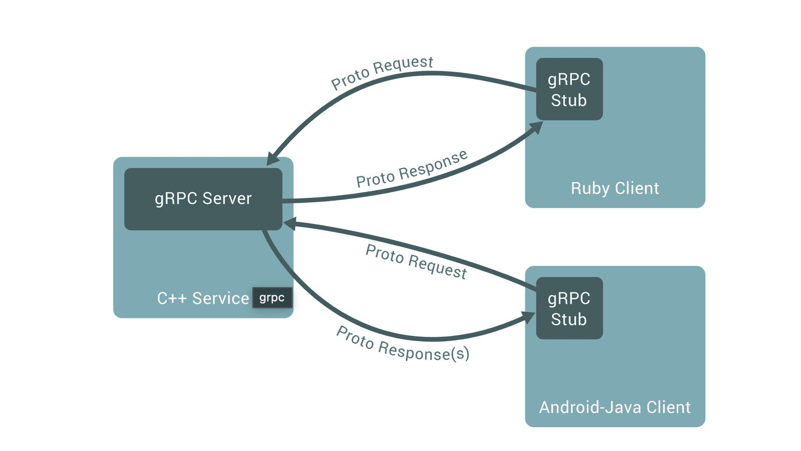

# Go lang 스터디 - 5주차

# RPC란?

Remote Procedure Call 의 약자로서 **분산환경 시스템**에서 **서로 다른 주소에서 서로를 호출하지만 서로 같은 주소에서 호출 하는 것처럼 작동**하게 하는 기능

<aside>
💡 **Proto Request, Proto Response 는 서버 클라이언트 모두 필요**
일반적으로, proto 파일은 공통으로 관리되며 클라이언트와 서버 간에 공유됩니다. 클라이언트와 서버는 각각 해당 proto 파일을 사용하여 필요한 코드를 생성하고, 그에 맞게 구현합니다. 이렇게 함으로써 클라이언트와 서버는 동일한 메시지 형식과 인터페이스를 공유하며, 일관성 있는 통신을 할 수 있습니다.

</aside>



## gRPC 사용 이유

- 빠르다 → 데이터의 크기도 적으며 직렬화 과정을 압축해서 빠름
- 엄격한 사양 덕분에 생기는 가이드의 존재 유무 (IDL) → proto buffer를 통해 사전에 교환할 데이터에 대한 정의를 해야함
- HTTP/2 → 병렬 처리가능, connection header의 압출을 통한 비용을 아낄 수 있음

# gRPC 형식

- ****Unary : client가 request를 보내면 응답을 받을 때 까지 대기****
- ****Server-side streaming : server가 응답을 보낼 시 strem으로 데이터를 return 하는 형태 한번의 큰 데이터를 return 시 blocking 방지를 위한 기능****
- ****Client-side streaming : client가 많은 양의 request를 요청하게 될 시 strem 형태로 요청하게 되며 server가 모든 데이터를 받아 처리할 떄 까지 대기하게됨****
- ****Bidirectional streaming : client와 server가 둘다 stream방식으로 서로 주고 받는 방식이다. 2개의 stream은 각각 독립적이여서 client나 server는 어떤 순서로도 동작이 가능하다. 예시를 들면, server는 client가 stream으로 request를 다 보낼때까지 기다리고 나서 response를 주던지, 혹은 request가 올 때마다 바로 response를 보낼 것인지 자율적으로 할 수 있다.****

# 유용한 feature

## ****Authentication****

통신 보안을 강화하고싶을 경우 grpc-go Authentication feature를 제공

[grpc-go/examples/features/authentication at master · grpc/grpc-go](https://github.com/grpc/grpc-go/tree/master/examples/features/authentication)

- **Client**
    
    WithPerCredentials() - Connection을 맺을 때 보안 검사를 진행하고, 같은 connection안에서는 여러번의 RPC call이 이뤄지더라도 같은 OAuth 토큰으로 보안 검사를 한다.
    
    WithTransportCredentials() - TLS와 같은 transport단에서 보안을 강화해준다.
    
- **Server**
    
    middleware의 UnaryInterceptor를 통해 인증하는 함수에 해나 로직을 추가
    
    ```go
    opts := []grpc.ServerOption{
    		// 토큰 인증하는 interceptor
    		grpc.UnaryInterceptor(ensureValidToken),
    		// Connection에 TLS를 허용한다
    		grpc.Creds(credentials.NewServerTLSFromCert(&cert)),
    	}
    ```
    

## ****Encryption****

Authentication을 통해 인증되어진 연결에 대해 TLS 기능을 지원한다

[grpc-go/examples/features/encryption at master · grpc/grpc-go](https://github.com/grpc/grpc-go/tree/master/examples/features/encryption)

## ****Health****

연동되어진 grpc의 상태를 체크하는 기능

[grpc-go/examples/features/health at master · grpc/grpc-go](https://github.com/grpc/grpc-go/tree/master/examples/features/health)

## ****Interceptor****

중간에 먼저 처리해야할 로직을 위한 middleware와 같은 시스템

[grpc-go/examples/features/interceptor at master · grpc/grpc-go](https://github.com/grpc/grpc-go/tree/master/examples/features/interceptor)

## ****Keepalive****

Keepalive는 **client와 server간 connection이 계속 유지되고 있는지 확인하기 위해 중요한 feature**이다. Connection이 서버 시작할 때 맺어지고 나서 connection이 도중에 끊어졌는데 client에서는 이 사실을 모르고 있다면 나중에 통신을 시도할 때 실패하게 된다. 이를 방지하기 위해서는 **keepalive라는 전략을 사용해서 통신이 이뤄지고 있지 않는 타이밍에도 간헐적으로 connection의 상태를 확인**할 수 있다. 그러면 통신 실패하기 전에 connection이 끊어졌음을 더 빠르게 알 수 있고, 더 빠르게 조치를 취할 수 있게 된다.

<aside>
💡 EnforcementPolicy 를 통한 보안기능 구현
client로 부터 악의적인 방법의 요청이 들어 왔을 경우 connection을 강제로 닫아버리는 기능

</aside>

[grpc-go/examples/features/keepalive at master · grpc/grpc-go](https://github.com/grpc/grpc-go/tree/master/examples/features/keepalive)