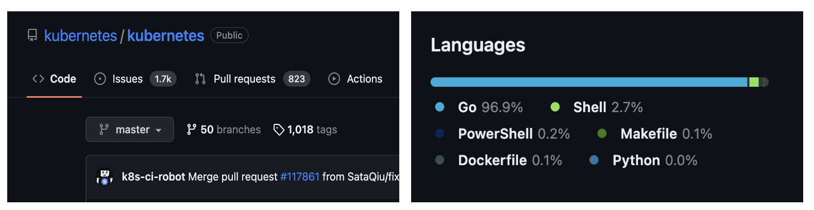

# Go -Lang 스터디

## 🤔목적

---

- **언어의 필요성**
    
    클라우드 시장과 개발환경에 대한 변화 -CNCF 프로젝트 → 관련 프로젝트의 개발 언어로서 Go 언어가 채택되어지고 있음
    
    [예시] kubernetes, terraform
    
    
    
    
    
- **contributor로서의 기여**
    
    대부분의 CNCF 프로젝트가 오픈소스로서 Contributor를 지원 → 기여를 함으로써 개발자 커리어로써의 경험 획득
    
    
    

## 📖방법

---

1) **책을 통한 기본적인 문법 학습**

- 서적 - ‘Tucker의 Go 언어 프로그래밍’ 읽고 중요 포인트만 정리하여 발표
    
    <aside>
    💡 서적은 개인 구매
    
    </aside>
    
    
    

**2) grpc,protobuf 학습**

기술 블로그 참조 - ****Golang gRPC server 구축하기****

[Golang gRPC server 구축하기 (1) - gRPC란 무엇인가?](https://devjin-blog.com/golang-grpc-server-1/)

**3) source 코드 분석**

1,2 항목 종료 후 프로젝트를 선정하여 진행

**3) 프로젝트 기여**

1,2 항목 종료 후 프로젝트를 선정하여 진행

## 🗓️일정 및 계획

---

- **일정**
    
    주 1회 - 일요일 오후 쯤으로 예상
    
- **계획**

        책을 통한 기본 문법 학습 - 5주 ~ 7주 정도 예상
        grpc,protobuf 학습 -  1주 ~ 2주 정도 예상
        source 코드 분석 - 2주 ~ 3주 예상
        프로젝트 기여 - 4주 예상
    

    

## 🤲🏻발표 자료 업로드 방법
1) 해당 주차 디렉토리 생성

2) 주차 디렉토리에 본인 github 계정이름으로 디렉토리 생성

3) pull request 요청해서 merge 진행